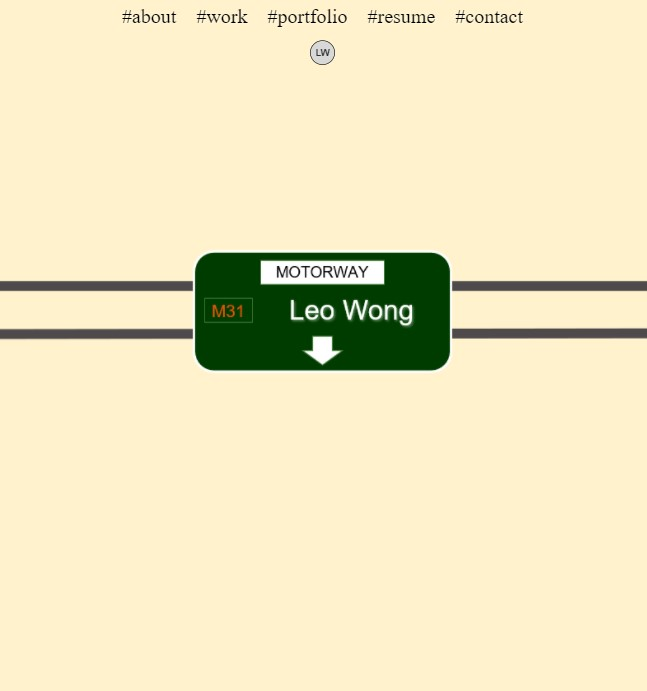
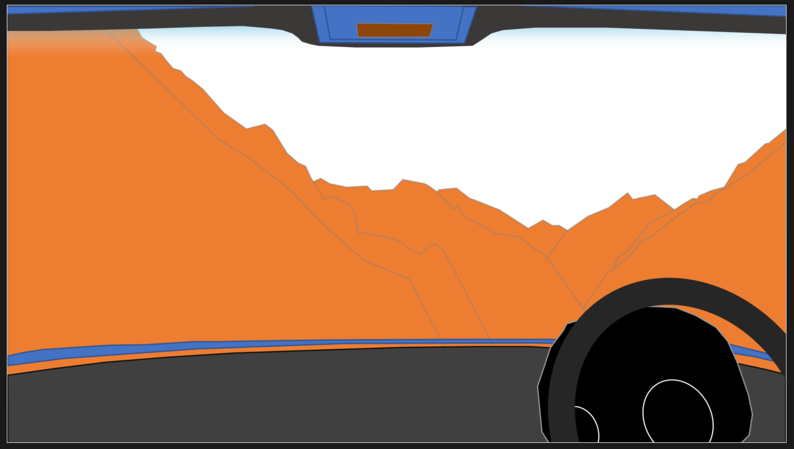
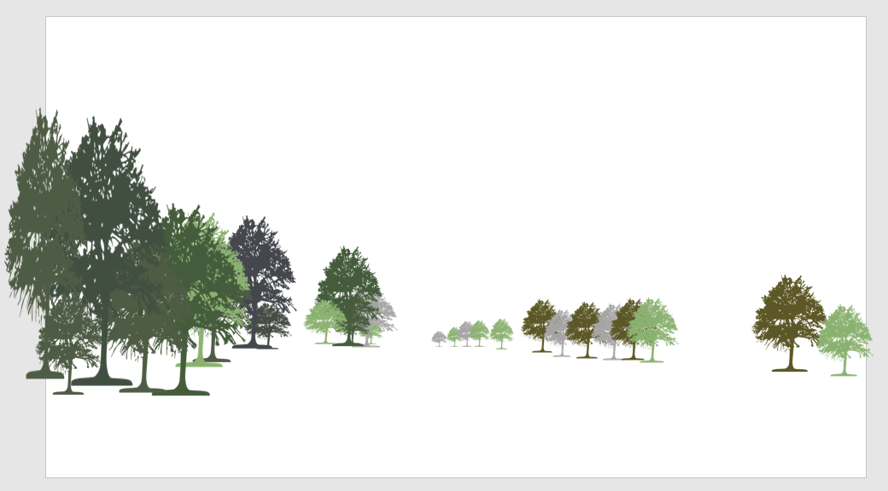
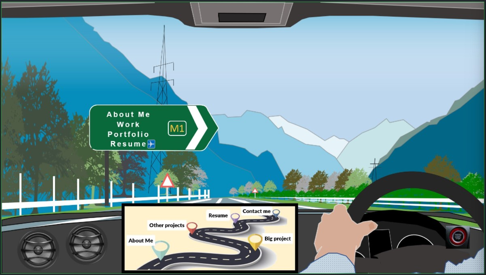

# Portfolio

 

## Description

This project was a challenge of design as well as functionality and coding. I wrote this app to illustrate the importance of flexbox as well as to provide a an opportunity to add interesting portfolios in the future. I included screenshots of my design process at the bottom of this README.

I designed the images individually in PowerPoint and eventually built an animation in PowerPoint and made a mockup gif. I then explored ways in which I could code the gif, and realised the limitations of CSS of on-scroll events.

I hope that in 3 months time (May 2022) I will be able to use Javascript and DOM Manipulation to make it even more interactive.

## Usage

To access the app, click on [Portfolio](https://leoelicos.github.io/bcs-02-portfolio/).

To move down the page, scroll down with your scroll button, or swipe up on your phone.

## Screenshots

### Portfolio

## Original Mockups

Some of my design process in its early stages:

### Initial idea 1

### Initial idea 2

### First Mockup

### Initial idea 3

### Second Mockup

## Credits

-  CSS Normalize https://necolas.github.io/normalize.css/

## License

&copy; Leo Wong <leoelicos@gmail.com>

Licensed under the [MIT License](./LICENSE.txt).

---
